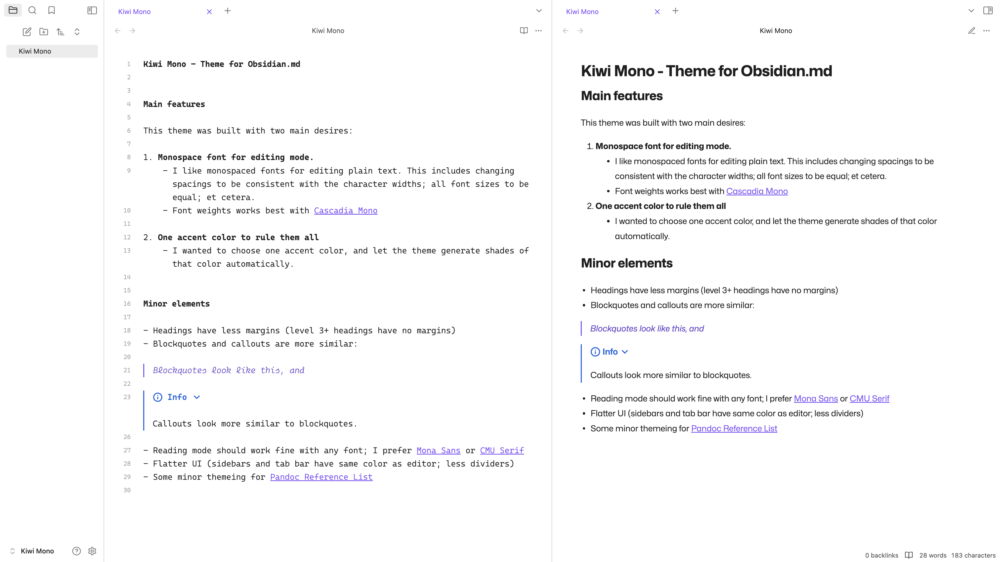
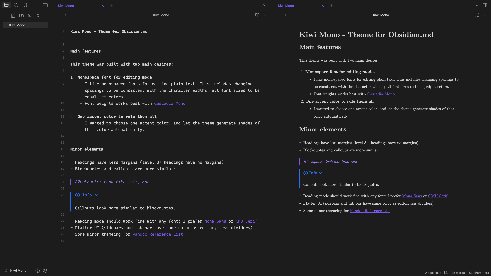

# Kiwi Mono

Monospaced supremacy for plain text!

## Main features

This theme was built with two main desires:

1. **Monospace font for editing mode.**
    - I like monospaced fonts for editing plain text. This includes changing spacings to be consistent with the character widths; all font sizes to be equal; et cetera.
    - Font weights works best with [Cascadia Mono](https://github.com/microsoft/cascadia-code)

2. **One accent color to rule them all**
    - I wanted to choose one accent color and let the theme generate shades of that color automatically.

## Minor elements

- Headings have less margins (level 3+ headings have no margins)

- Blockquotes and callouts look more similar

- Reading mode should work fine with any font; I prefer [Mona Sans](https://github.com/github/mona-sans) or [CMU Serif](https://sourceforge.net/projects/cm-unicode/)

- Flatter UI (sidebars and tab bar have same color as editor; less dividers)

- Some minor themeing for [Pandoc Reference List](https://github.com/mgmeyers/obsidian-pandoc-reference-list)

## Screenshots

Light mode (with Mona Sans)

Dark mode (with CMU Serif)

